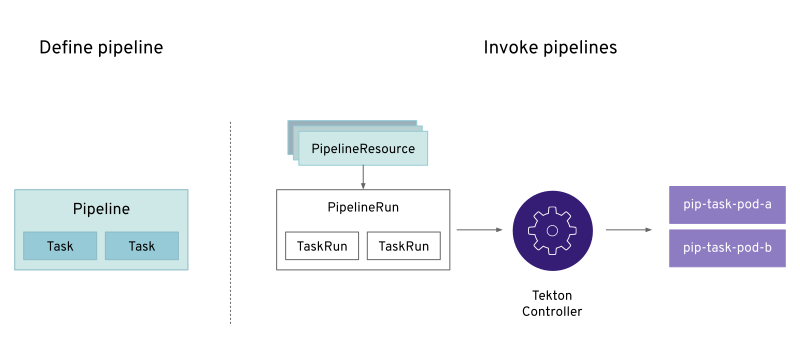

Tekton defines a number of Kubernetes custom resources as building blocks in order to standardize CI/CD concepts 
and provide terminology that is consistent across CI/CD solutions. These custom resources are an extension of the
Kubernetes API that let users create and interact with these objects using `kubectl` and other Kubernetes tools.

The custom resources needed to define a CI/CD pipeline using Tekton are listed below:

* `Task`: an ordered series of steps that perform a specific task (e.g. building a container image)
* `Pipeline`: a series of `Tasks` that can be performed in a particular order or in parallel 
* `PipelineResource`: inputs (e.g. git repository) and outputs (e.g. image registry) to and out of a `Pipeline` or `Task`
* `TaskRun`: the execution and result (i.e. success or failure) of running an instance of `Task`
* `PipelineRun`: the execution and result (i.e. success or failure) of running a `Pipeline`

An illustration of how these resources work together is shown below:

In the illustration, you can see how a `Pipeline` is composed of 
`Tasks`. Similarly, a `PipelineRun` is composed of `TaskRuns`. The collective results of all the `TaskRuns` determine whether a 
`PipelineRun` has succeeded or failed. The `PipelineResources` are provided as part of a `PipelineRun` or `TaskRun` so inputs and 
outputs are available during the execution of a `Pipeline`. 

All of the above custom resources are namespaced, meaning they can only be created and run in a particular Kubernetes namespace. 
For example, to run a `Pipeline` (i.e. a `PipelineRun`) with Tekton, a `Pipeline`, the `Tasks` that are part of a `Pipeline`, and 
the `PipelineRun` and associated `TaskRuns` all must be present and run in the same namespace.

There are Tekton resources available that have a cluster scope, such as a [`ClusterTask`](https://github.com/tektoncd/pipeline/blob/master/docs/tasks.md#clustertask). This means the resource has a global presence on the cluster and can be executed in any namespace on the cluster. 
This workshop will focus on namespaced resources, but keep in mind ideas around cluster-scoped resources when using Tekton.

Now that you have an understanding of some of the building blocks of Tekton, you will get a chance to start using some of these 
resources. In the next section, you will create a `Task` and execute it via a `TaskRun`.

Click the **Create and Run a Task** button to continue.